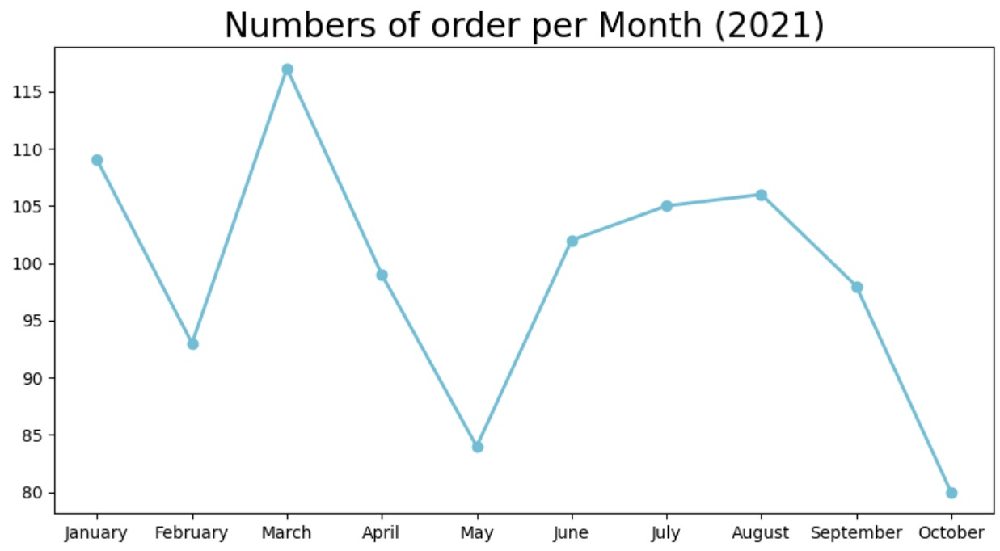
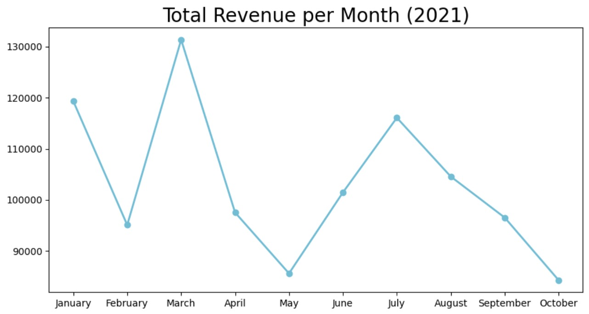
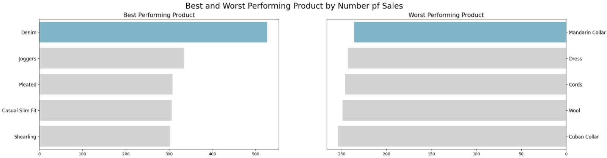
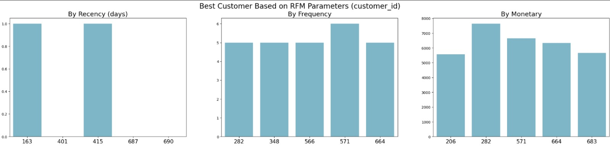

# 📊 Data Analyst Training

Proyek ini merupakan hasil pembelajaran Data Analyst menggunakan Python. Notebook ini mencakup proses analisis data secara end-to-end mulai dari pengumpulan data, pembersihan data, eksplorasi, visualisasi, hingga analisis perilaku pelanggan menggunakan metode RFM.

## 🚀 Features

- Data Loading dari beberapa dataset
- Data Cleaning
  - Menghapus data duplikat
  - Menangani missing values
  - Memperbaiki tipe data
  - Menangani data yang tidak valid
- Exploratory Data Analysis (EDA)
- Data Merging
- Data Visualization
- Customer Segmentation
- RFM Analysis (Recency, Frequency, Monetary)

## 🛠️ Tech Stack

- Python
- Pandas
- NumPy
- Matplotlib
- Seaborn
- Jupyter Notebook

## 📂 Project Structure

```
Data-Analyst-Training/
│
├── Training_DataAnalyze.ipynb
├── README.md
```

## ▶️ Installation

Clone repository

```bash
git clone https://github.com/satriopndt/Data-Analyst-Training.git
```

Install dependencies

```bash
pip install pandas numpy matplotlib seaborn
```

## 📚 Learning Outcomes

- Data preprocessing
- Data cleaning
- Exploratory Data Analysis (EDA)
- Data visualization
- Customer segmentation
- RFM Analysis

## 📷 Preview

### Number of Orders per Month (2021)



### Total Revenue per Month (2021)



### Best & Worst Performing Products



### RFM Analysis


